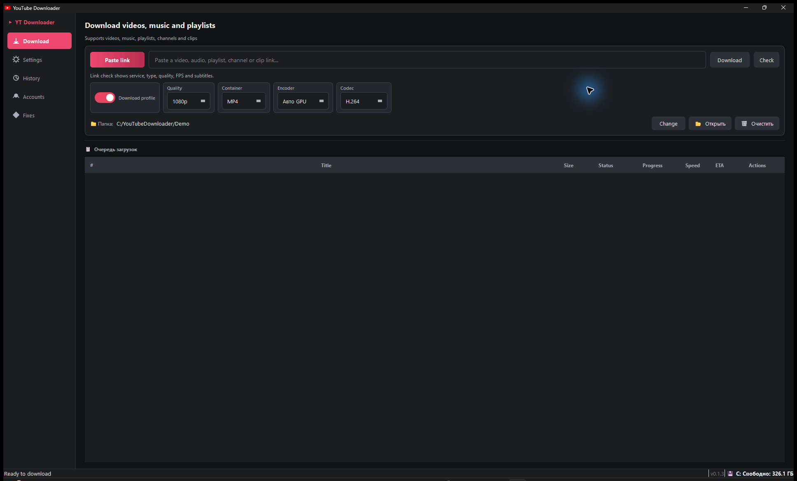
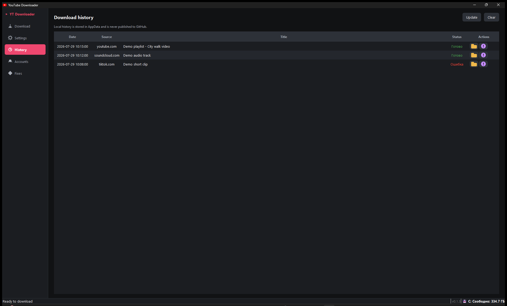
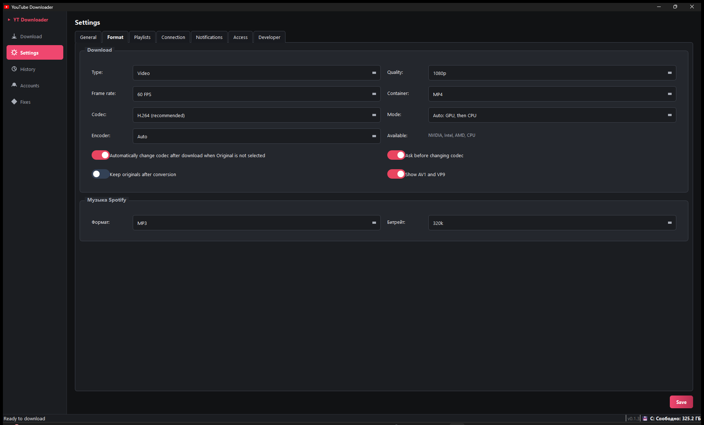
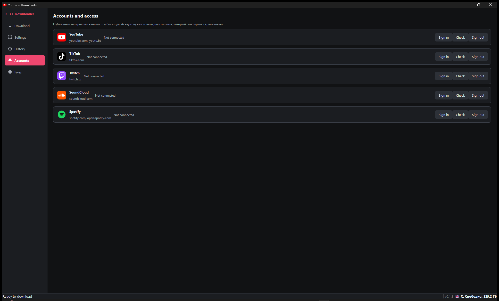
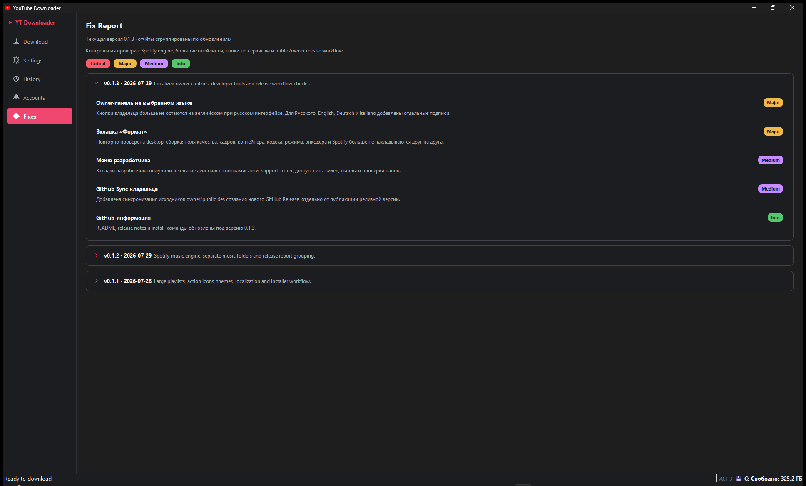
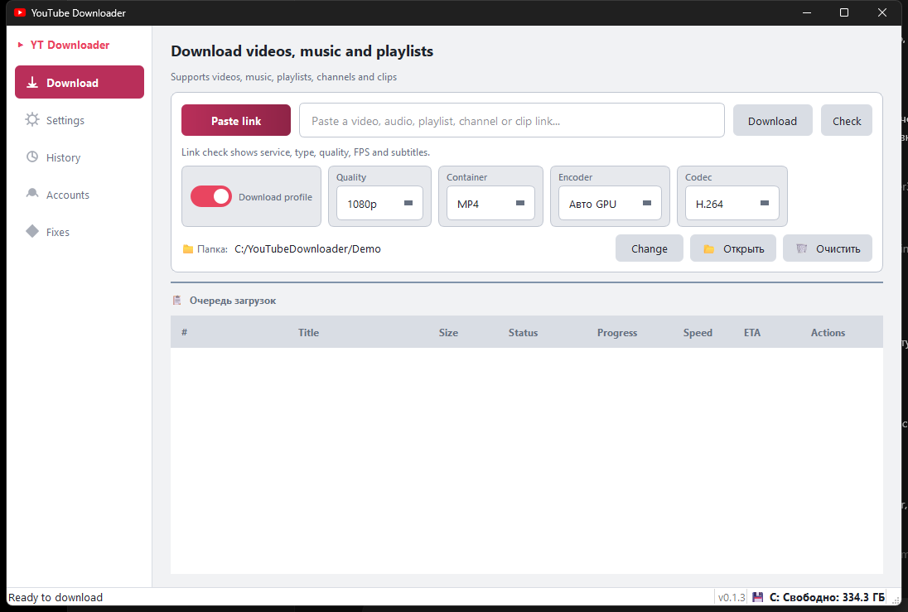

# YouTube Downloader

A clean Windows desktop app for downloading public video and music links with a real queue, quality controls, local settings, and a privacy-first workflow.

It is built for people who want a normal Windows app instead of command-line tools: paste a link, choose quality, add it to the queue, and manage downloads from one interface.

[](https://github.com/Vladosik151614/YouTubeDownloader/actions/workflows/ci.yml)
[](https://github.com/Vladosik151614/YouTubeDownloader/releases/latest)
[](https://github.com/Vladosik151614/YouTubeDownloader/releases)
[](LICENSE)



## Quick Value

- Real Windows desktop app, not only a CLI script.
- Download queue with pause, retry, cancel and open-folder actions.
- Quality, FPS, container and H.264 conversion controls.
- Public downloads work without account sign-in where supported.
- Restricted content can use a separate app Chrome profile.
- Local-first storage: settings, logs and history stay on your computer.
- Sanitized support reports that avoid cookies, tokens and private paths.

## Download

Latest Windows installer:
[Download YouTube Downloader for Windows](https://github.com/Vladosik151614/YouTubeDownloader/releases/latest)

Direct installer link:
[YouTubeDownloaderSetup-0.1.3.exe](https://github.com/Vladosik151614/YouTubeDownloader/releases/latest/download/YouTubeDownloaderSetup-0.1.3.exe)

Read the [Privacy Policy](PRIVACY.md) before sharing logs or publishing builds.

## Why Choose This App?

Most downloader tools are either command-line utilities, ad-heavy websites, or unclear installers. This project focuses on a simple Windows desktop experience:

- No browser extension required.
- No normal Chrome profile sharing by default.
- No cloud account required for public downloads.
- Clear queue and history instead of one-time download buttons.
- Separate service folders and local settings.
- Safer bug reports that avoid leaking private data.

## Features

- Windows GUI downloader for videos, music, playlists, channels and clips where supported.
- Multi-service workflow for YouTube, TikTok, Twitch, SoundCloud, Spotify metadata resolving and other supported links.
- Download profiles for video/audio type, quality, FPS, container, codec and encoder mode.
- Optional H.264 conversion with GPU-first mode and CPU fallback.
- Local history, queue actions, retry, pause, cancel and open-folder controls.
- Separate folders for services and media types.
- Optional separate app Chrome profile for account-required content.
- Proxy settings, notification settings and lightweight speed checks.
- Developer diagnostics and sanitized support reports.
- Windows installer with normal and silent install support.

## Screenshots

| Main download screen | History and queue |
| --- | --- |
|  |  |

| Quality settings | Account access |
| --- | --- |
|  |  |

| Fix and support report | Theme preview |
| --- | --- |
|  |  |

## Supported Services

| Service | Support | Notes |
| --- | --- | --- |
| YouTube | Video, audio and playlists where supported | Public content should work without sign-in |
| TikTok | Video where supported | Depends on source availability |
| Twitch | Clips and videos where supported | Some content may require access |
| SoundCloud | Audio where supported | Depends on provider/source |
| Spotify | Metadata-based music resolving | DRM-protected Spotify audio is not decrypted |

## Basic Usage

1. Open the app.
2. Paste a supported video, music, playlist, channel or clip link.
3. Choose a download profile if needed.
4. Click `Download`.
5. Watch the queue progress.
6. Use pause, retry or cancel from the queue when needed.
7. Click the folder action to open the saved file location.

## Install From Command Line

Normal install:

```powershell
irm "https://github.com/Vladosik151614/YouTubeDownloader/releases/latest/download/YouTubeDownloaderSetup-0.1.3.exe" -OutFile "$env:TEMP\YouTubeDownloaderSetup.exe"; Start-Process "$env:TEMP\YouTubeDownloaderSetup.exe" -Wait
```

Silent install:

```powershell
$url = "https://github.com/Vladosik151614/YouTubeDownloader/releases/latest/download/YouTubeDownloaderSetup-0.1.3.exe"
$installer = "$env:TEMP\YouTubeDownloaderSetup.exe"
Invoke-WebRequest $url -OutFile $installer
Start-Process $installer -ArgumentList "/VERYSILENT /SUPPRESSMSGBOXES /NORESTART" -Wait
```

## Account Access

Sign-in is optional. Public content should work without an account where supported by the download system.

For restricted content, open `Accounts`, choose the service and sign in once in the separate Chrome window opened by the app. The app is designed to use a separate app Chrome profile instead of your normal browser profile by default.

Spotify support uses metadata resolving through available audio providers. DRM-protected Spotify audio is not decrypted.

## Privacy and Safety

This app is designed as a local Windows desktop tool. Settings, logs, history and access data are stored locally on your computer. Support reports are sanitized to avoid cookies, tokens and private local paths.

For restricted content, the app uses a separate app Chrome profile instead of your normal browser profile by default.

Do not paste cookies, passwords, tokens, private browser data or private local paths into public GitHub issues.

## What This App Is Not

- It is not a DRM bypass tool.
- It does not decrypt protected Spotify audio.
- It does not upload your cookies or local history to a server.
- It is not a web converter site.
- It is not a replacement for respecting creator rights or platform terms.

## Documentation

- [User Guide EN](docs/USER_GUIDE_EN.md)
- [Руководство RU](docs/USER_GUIDE_RU.md)
- [Privacy Policy](PRIVACY.md)
- [User Agreement](USER_AGREEMENT.md)
- [Changelog](CHANGELOG.md)
- [Engineering Standards](docs/ENGINEERING_STANDARDS.md)
- [Maintainer Workflow](docs/MAINTAINER_WORKFLOW.md)
- [Product Roadmap](docs/PRODUCT_ROADMAP.md)

## FAQ

### Does it work without signing in?

Public content should work without account sign-in where supported by the download engine.

### Does it use my normal Chrome profile?

No. Restricted content uses a separate app Chrome profile by default.

### Can it download Spotify songs directly?

Spotify support uses metadata resolving through available audio providers. DRM-protected Spotify audio is not decrypted.

### Where are settings and history stored?

They are stored locally outside the source folder, under the app data folder on Windows.

### Is this a web converter?

No. It is a Windows desktop app.

### Why can some links fail?

Services can change their pages, block access, require sign-in, limit regions, or restrict downloads.

## Reporting Problems

Use GitHub Issues for bugs and feature requests:

- [Report a bug](https://github.com/Vladosik151614/YouTubeDownloader/issues/new?template=bug_report.yml)
- [Report a download error](https://github.com/Vladosik151614/YouTubeDownloader/issues/new?template=download_error.yml)
- [Request a feature](https://github.com/Vladosik151614/YouTubeDownloader/issues/new?template=feature_request.yml)

When reporting a problem, include the app version, Windows version, link type, what you clicked, and the sanitized support report if available. Do not include cookies, tokens, passwords, private links or private local paths.

## Development

Before committing or publishing changes, run:

```powershell
python tools\privacy_check.py
python tools\quality_check.py
```

Generated folders such as `build/`, `dist/` and `release/` must not be committed. Owner-only maintainer tools are kept out of the public repository.

See [CONTRIBUTING.md](CONTRIBUTING.md) for contribution and issue-reporting rules.

## License

MIT License. See [LICENSE](LICENSE).
