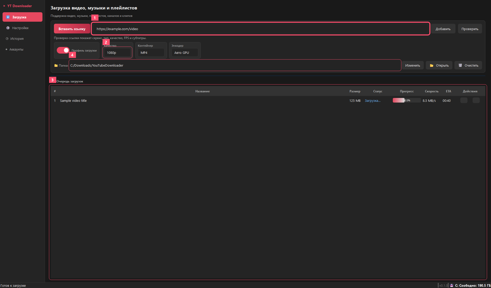
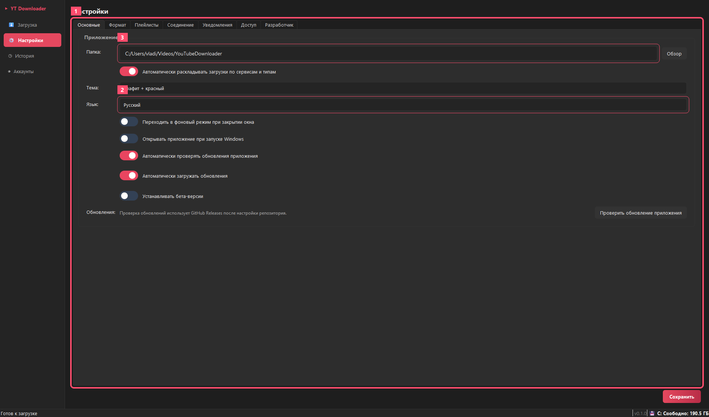
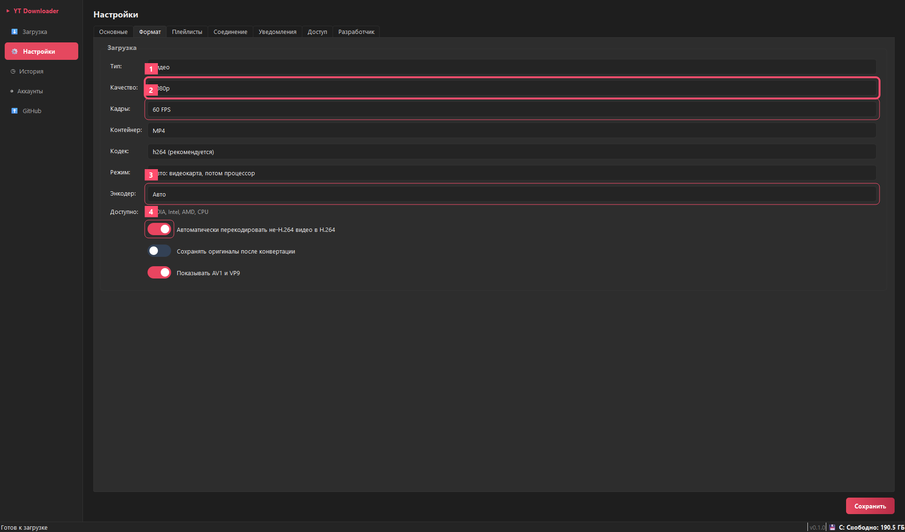
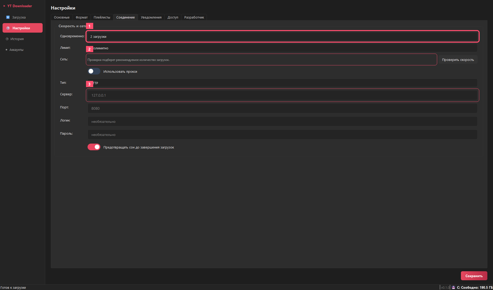
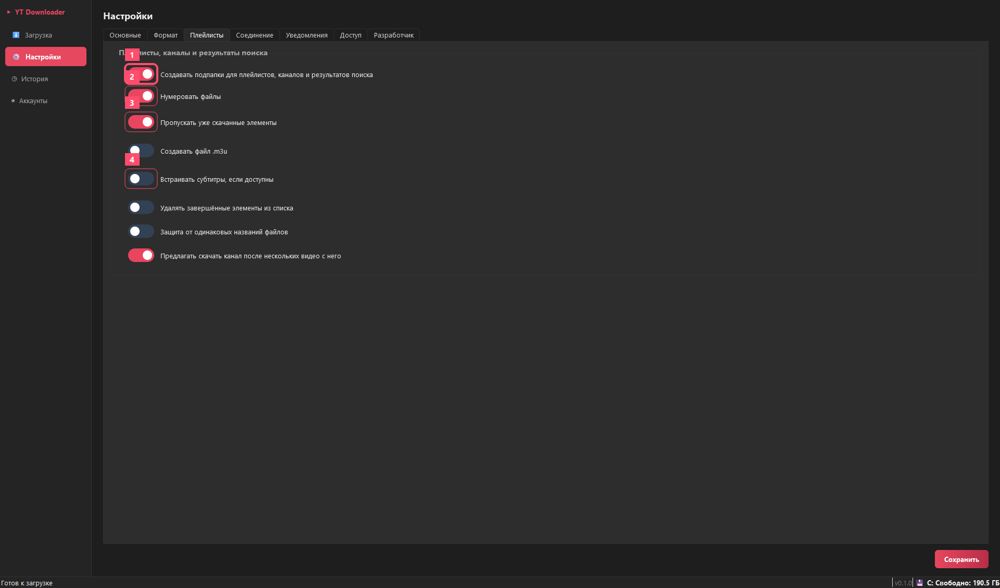
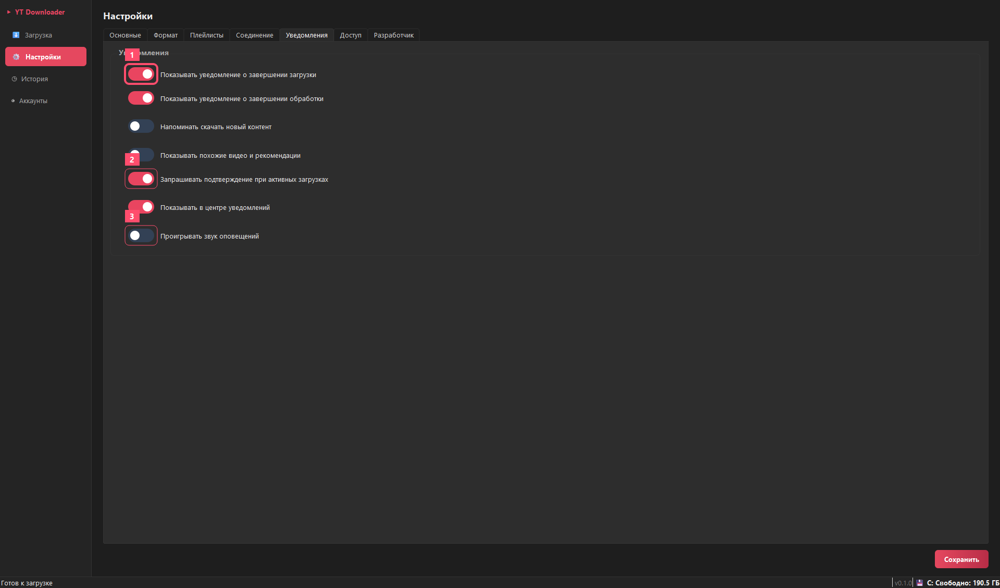
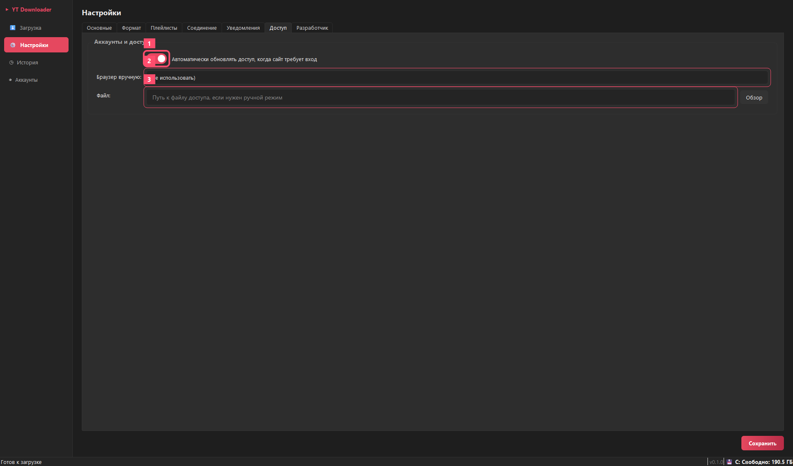
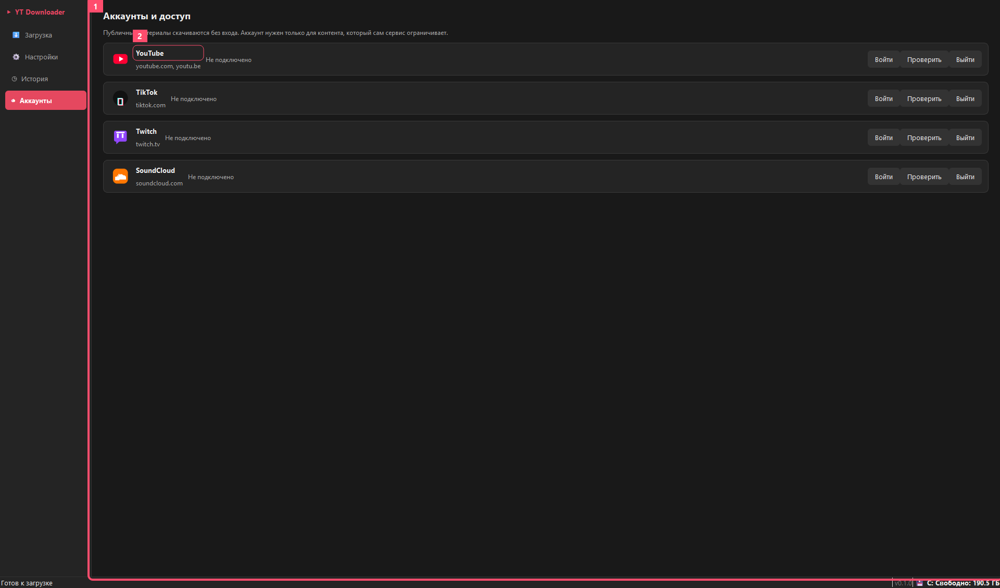
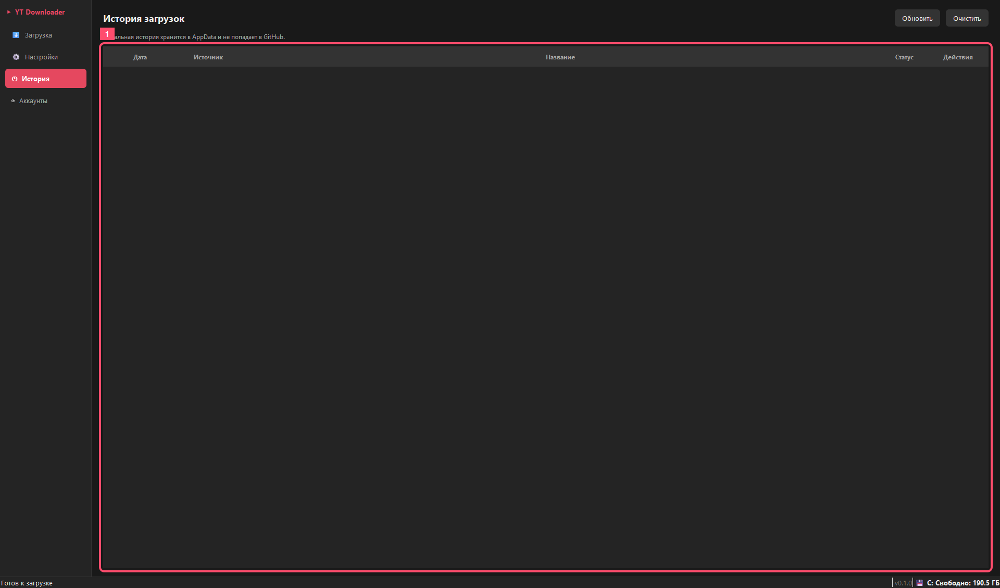

# User Guide

App version: `0.1.1`

## What It Is

YouTube Downloader is a Windows desktop app for downloading videos, music, playlists, channels, clips, thumbnails and metadata from supported services. The main workflow is intentionally simple: paste a link, choose a profile, add it to the queue and open the output folder.

Supported workflows:

- YouTube videos, playlists, channels and audio.
- SoundCloud tracks and audio pages where supported by the service.
- Twitch clips and available VODs.
- TikTok public videos when the service does not block the current network.
- Other supported sites handled by the app's download system.

Account sign-in is optional. It is only needed when the service itself requires login, age confirmation or account-limited access.

## Installation

### Normal Installer

1. Run `YouTubeDownloaderSetup-0.1.1.exe`.
2. Choose the installer language.
3. Accept the user agreement.
4. Keep the default install folder or choose your own.
5. Finish the installation and launch the app.

The installer uses a per-user Windows folder and does not require administrator rights.

### Portable Launch

You can also run `YouTubeDownloader.exe` directly. This is useful for quick checks and development.

### PowerShell Install Command

This command downloads the latest installer from GitHub Releases to the Windows temp folder and starts the normal installer wizard:

```powershell
irm "https://github.com/Vladosik151614/YouTubeDownloader/releases/latest/download/YouTubeDownloaderSetup-0.1.1.exe" -OutFile "$env:TEMP\YouTubeDownloaderSetup.exe"; Start-Process "$env:TEMP\YouTubeDownloaderSetup.exe" -Wait
```

Silent install without windows:

```powershell
$url = "https://github.com/Vladosik151614/YouTubeDownloader/releases/latest/download/YouTubeDownloaderSetup-0.1.1.exe"
$installer = "$env:TEMP\YouTubeDownloaderSetup.exe"
Invoke-WebRequest $url -OutFile $installer
Start-Process $installer -ArgumentList "/VERYSILENT /SUPPRESSMSGBOXES /NORESTART" -Wait
```

Local installer when the setup file is already downloaded next to PowerShell:

```powershell
.\YouTubeDownloaderSetup-0.1.1.exe
```

Later, a `winget` manifest can make the install command shorter:

```powershell
winget install <publisher>.YouTubeDownloader
```

## Download Screen



1. Link field. Paste a video, playlist, channel, music or clip URL.
2. Quick download profile. Choose quality, container and encoder.
3. Download queue. Track status, progress, speed, ETA and actions.
4. Save folder. Downloaded files are saved here.

## Downloading Video Or Music

1. Copy a supported link.
2. Click `Paste Link` or paste it manually.
3. Click `Check` if you want to preview service, type, quality, FPS and subtitles.
4. Choose quality, container and encoder if needed.
5. Click `Add`.
6. Watch the queue progress.
7. Click the folder icon after completion to open the result.

Queue actions:

- `Pause` stops the download while keeping partial files.
- `Continue` starts it again and resumes when the service supports it.
- `Cancel` removes an active item.
- `Retry` adds a failed link again.
- `!` opens error details and a safe support report.

## Settings



1. Settings categories.
2. Interface language: Russian, English, German, Italian.
3. Default download folder.

General settings include:

- automatic folder routing by service and type;
- app theme;
- launch with Windows;
- background mode on close;
- update checks.

## Format And Encoding



1. Resolution: best, 2160p, 1440p, 1080p, 720p, 480p.
2. FPS: best, 60 FPS or 30 FPS.
3. Encoder: auto, NVIDIA NVENC, Intel Quick Sync, AMD AMF, CPU x264.
4. Automatic H.264 conversion.

Default profile:

- video;
- `1080p`;
- `60 FPS`;
- `MP4`;
- `H.264`;
- automatic encoder: GPU first, CPU fallback.

Audio-only downloads do not use video conversion. The app does not ask for H.264 conversion when the result has no video stream.

## Connection And Speed



1. Maximum concurrent downloads.
2. Network speed check and concurrency recommendation.
3. Proxy settings: type, server, port, username and password.

Proxy is optional. Use it only when a service blocks the current network or when your environment requires it.

## Playlists And Channels



1. Subfolders create separate folders for playlists, channels and search results.
2. Numbering keeps items in source order.
3. Duplicate skipping avoids downloading files that are already present in the archive.
4. Subtitles are saved or embedded when the service and selected format support it.

These settings matter most for large playlists and channels because they keep files organized and reduce repeat downloads.

## Notifications



1. Download and processing notifications report completion without opening the window.
2. Exit confirmation helps avoid accidentally closing the app while downloads are active.
3. Alert sounds can be enabled separately.

When background mode is enabled, the app can stay in the tray and report completion through Windows notifications.

## Access Settings



1. Automatic access refresh is used when a service requires sign-in.
2. Manual browser selection is for diagnostics.
3. Manual access files are only needed when automatic mode is not suitable.

Normal users usually do not need to change this section. Public links should download without sign-in.

## Accounts And Access



1. Sign-in is optional for public content.
2. Each service can open its own isolated sign-in window.

Access model:

- the app uses a separate Chrome profile;
- it does not read the user's normal Chrome profile by default;
- sign-in is only needed when a service requires it;
- access data stays local on the computer.

If a public download works without sign-in, do not sign in.

## History



1. History lists completed and failed downloads.

From history, users can open the result folder or inspect error details.

## Errors And Reports

Normal users see action-oriented errors: retry, check network, sign in or change folder. Technical details are only shown in Developer Mode.

`Copy Report` creates a safe report without private access data. `Open GitHub` opens a GitHub issue form when the user wants to send the error to the developer.

## Browser Interface For Checks

For development checks:

```powershell
python main.py --web
```

It uses the same settings and download system. The primary end-user interface remains the desktop app.

## Local Data

The app stores settings, history, logs and access data locally in the Windows user profile. These files must not be committed to the repository.

Before publishing, run:

```powershell
python tools\quality_check.py
python tools\privacy_check.py
```

## Release Checklist

- Single video.
- Playlist.
- Audio-only.
- 1080p/60 FPS.
- 1440p or 2160p on a video where those qualities exist.
- SoundCloud.
- Twitch.
- TikTok, considering possible network restrictions.
- Pause, continue, cancel and retry.
- Install and uninstall through `YouTubeDownloaderSetup-0.1.1.exe`.

