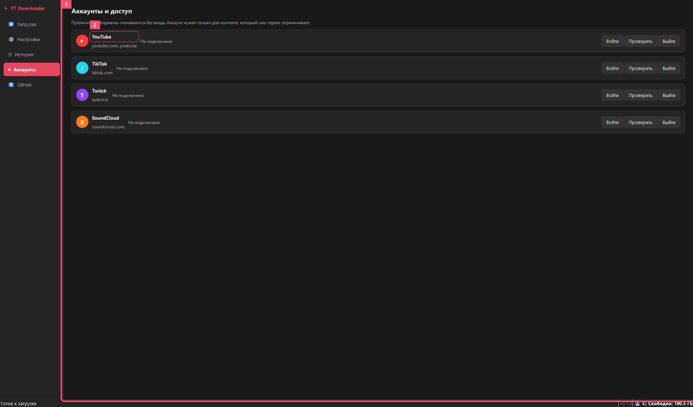
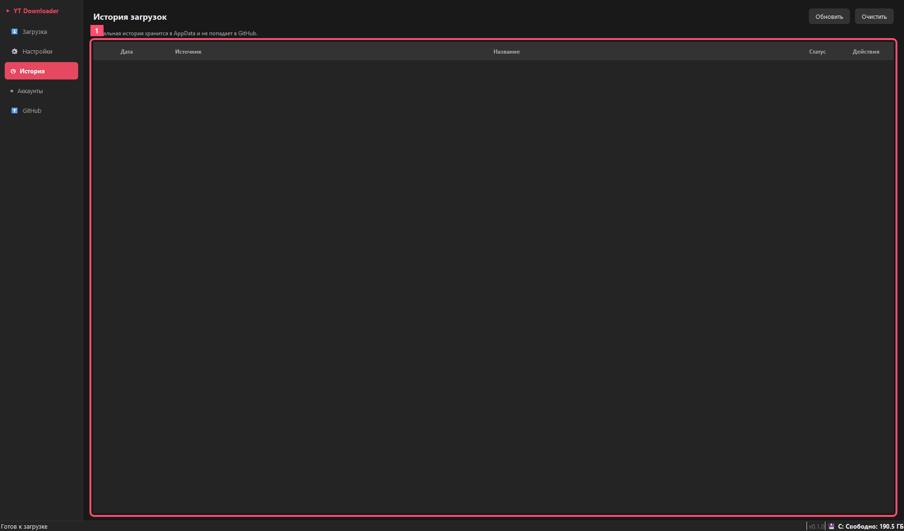
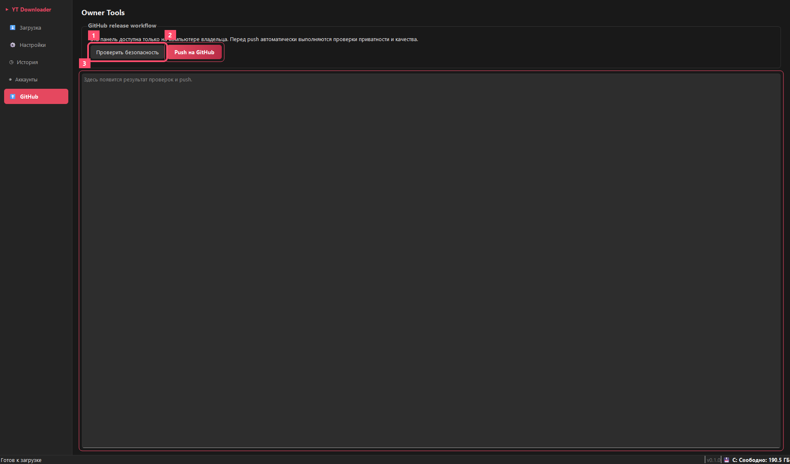

# Руководство Пользователя

Версия приложения: `0.1.0`

## Что Это

YouTube Downloader - desktop-приложение для Windows, которое скачивает видео, музыку, плейлисты, каналы, клипы, миниатюры и описания из поддерживаемых сервисов. Основной режим рассчитан на обычного пользователя: вставил ссылку, выбрал качество, добавил в очередь и открыл папку с результатом.

Поддерживаемые сценарии:

- YouTube: видео, плейлисты, каналы и аудио.
- SoundCloud: музыка и аудио-страницы, где это поддерживается сервисом.
- Twitch: клипы и доступные VOD.
- TikTok: публичные видео, если сервис не ограничивает доступ с текущей сети.
- Дополнительные сайты, если они поддерживаются системой загрузки приложения.

Вход в аккаунт не обязателен. Он нужен только для материалов, где сам сервис требует вход, возрастное подтверждение или доступ к аккаунту.

## Установка

### Обычная Установка

1. Запустите `YouTubeDownloaderSetup-0.1.0.exe`.
2. Выберите язык установщика.
3. Примите пользовательское соглашение.
4. Оставьте стандартную папку установки или выберите свою.
5. Завершите установку и запустите приложение.

Приложение устанавливается в пользовательскую папку Windows и не требует админ-прав.

### Portable Запуск

Можно запустить `YouTubeDownloader.exe` напрямую. Этот вариант удобен для проверки и разработки.

### Установка Через Командную Строку

Локальный установщик:

```powershell
.\YouTubeDownloaderSetup-0.1.0.exe /VERYSILENT /SUPPRESSMSGBOXES /NORESTART
```

После публикации релиза на GitHub можно использовать прямую команду:

```powershell
$url = "https://github.com/Vladosik151614/YouTubeDownloader/releases/latest/download/YouTubeDownloaderSetup-0.1.0.exe"
$installer = "$env:TEMP\YouTubeDownloaderSetup.exe"
Invoke-WebRequest $url -OutFile $installer
Start-Process $installer -ArgumentList "/VERYSILENT /SUPPRESSMSGBOXES /NORESTART" -Wait
```

Позже можно добавить официальный `winget`-манифест. Тогда установка будет выглядеть так:

```powershell
winget install <publisher>.YouTubeDownloader
```

## Главный Экран


1. Поле ссылки. Вставьте ссылку на видео, плейлист, канал, музыку или клип.
2. Быстрый профиль загрузки. Здесь выбираются качество, контейнер и энкодер.
3. Очередь загрузок. Здесь видны статус, прогресс, скорость, ETA и действия.
4. Папка сохранения. Результаты будут сохраняться сюда.

## Как Скачать Видео Или Музыку

1. Скопируйте ссылку в браузере или приложении.
2. Нажмите `Вставить ссылку` или вставьте ссылку вручную.
3. При необходимости нажмите `Проверить`, чтобы увидеть тип, качество, FPS и субтитры.
4. Выберите качество, контейнер и энкодер.
5. Нажмите `Добавить`.
6. Следите за прогрессом в очереди.
7. После завершения нажмите значок папки, чтобы открыть результат.

Кнопки в очереди:

- `Пауза` останавливает загрузку с сохранением частичного файла.
- `Продолжить` запускает загрузку снова и использует продолжение, если сервис это поддерживает.
- `Отмена` убирает активную загрузку.
- `Повторить` добавляет ошибочную ссылку заново.
- `!` показывает детали ошибки и безопасный отчет.

## Настройки


1. Категории настроек.
2. Язык интерфейса: русский, английский, немецкий, итальянский.
3. Папка загрузки по умолчанию.

Основные настройки:

- автоматическая раскладка по папкам сервисов;
- тема интерфейса;
- запуск вместе с Windows;
- фоновый режим при закрытии окна;
- автоматическая проверка обновлений.

## Формат И Кодирование


1. Разрешение: лучшее, 2160p, 1440p, 1080p, 720p, 480p.
2. FPS: лучшее, 60 FPS или 30 FPS.
3. Энкодер: авто, NVIDIA NVENC, Intel Quick Sync, AMD AMF, CPU x264.
4. Автоматическое перекодирование в H.264.

Стандартный профиль:

- видео;
- `1080p`;
- `60 FPS`;
- `MP4`;
- `H.264`;
- авто-энкодер: видеокарта, затем процессор.

Для музыки не применяется видеоперекодирование. Если выбран режим `Только аудио`, приложение скачивает аудио без предложения H.264.

## Соединение И Скорость


1. Максимум одновременных загрузок.
2. Проверка скорости сети и рекомендация количества загрузок.
3. Настройки прокси: тип, сервер, порт, логин и пароль.

Если сервис ограничивает доступ с текущей сети, можно включить прокси. Для обычных YouTube/SoundCloud/Twitch загрузок прокси обычно не нужен.

## Аккаунты И Доступ



1. Вход не обязателен для публичного контента.
2. Для каждого сервиса можно открыть отдельное окно входа.

Как работает доступ:

- приложение использует отдельный профиль Chrome;
- обычный Chrome пользователя не читается по умолчанию;
- вход нужен только если сервис сам требует аккаунт;
- данные доступа хранятся локально на компьютере.

Если скачивание публичного видео работает без входа, входить в аккаунт не нужно.

## История



1. История показывает завершенные и ошибочные загрузки.

В истории можно открыть папку результата или посмотреть детали ошибки.

## Ошибки И Отчеты

Обычный пользователь видит понятное сообщение: повторить загрузку, проверить сеть, войти в аккаунт или изменить папку. Технические детали показываются только в режиме разработчика.

Кнопка `Скопировать отчет` создает безопасный отчет без приватных данных. Кнопка `Открыть GitHub` открывает форму issue, если пользователь хочет отправить ошибку разработчику.

## Меню Владельца GitHub



Этот раздел не отображается у обычных пользователей. Он появляется только на компьютере владельца проекта, если включен локальный флаг владельца и GitHub CLI авторизован под аккаунтом проекта.

1. `Проверить безопасность` запускает проверки приватности и качества без публикации.
2. `Push на GitHub` запускает проверки, создает коммит при наличии изменений и отправляет ветку `main`.
3. Журнал показывает, какой шаг выполнен и где остановился процесс, если проверка не прошла.

Перед push приложение блокирует публикацию, если находит сборочные папки, локальные настройки, логи, cookie-файлы, токены или абсолютные пользовательские пути.

## Веб-Интерфейс Для Проверки

Для разработки можно запустить локальный интерфейс:

```powershell
python main.py --web
```

Он использует те же настройки и ту же систему загрузки, но основной пользовательский вариант - desktop-приложение.

## Где Хранятся Данные

Приложение хранит настройки, историю, логи и данные доступа локально в папке пользователя Windows. Эти файлы не должны попадать в репозиторий.

Перед публикацией нужно выполнить:

```powershell
python tools\quality_check.py
python tools\privacy_check.py
```

## Что Проверить Перед Релизом

- Одиночное видео.
- Плейлист.
- Только аудио.
- 1080p/60 FPS.
- 1440p или 2160p на видео, где эти качества доступны.
- SoundCloud.
- Twitch.
- TikTok с учетом возможных сетевых ограничений.
- Пауза, продолжение, отмена и повтор.
- Установка и удаление через `YouTubeDownloaderSetup-0.1.0.exe`.
